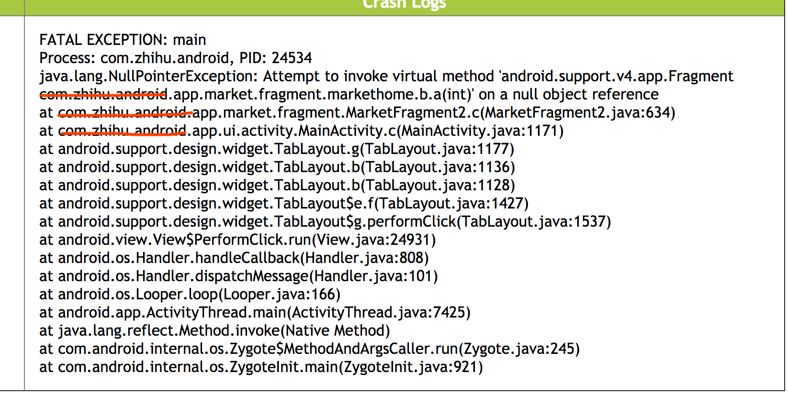
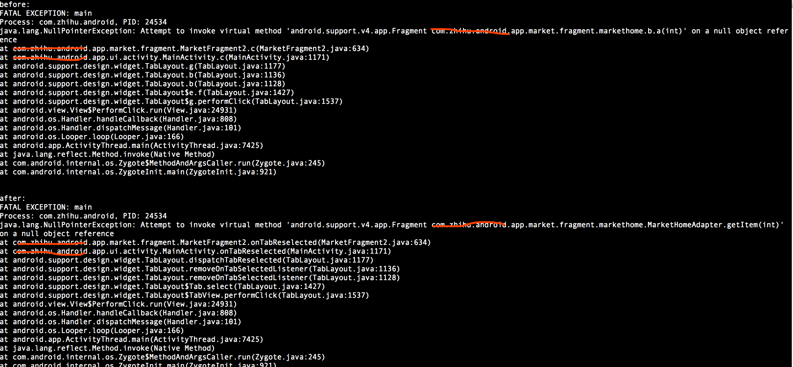

# Mapping Translator

We often feel confused when facing the the obfuscated code like this:

It's time to make a change!

Use this, and the world will be beautified.

Let's begin with [main.py](main.py)

